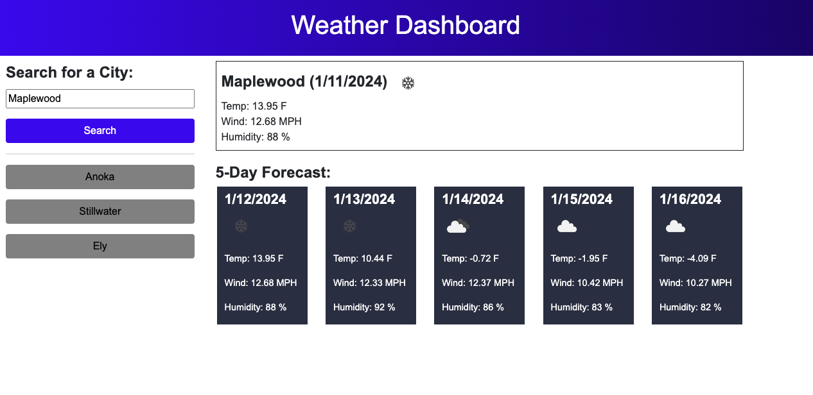

# Weather Dashboard

## Description

The purpose of this project was to build a weather dashboard that will run in the browser and feature dynamically updated HTML and CSS. 

Two APIs were used from OpenWeather--one for geolocation and one for the actual weather forecast data. Local storage is used to track recent search history.

## Installation

The project can be found at the following GitHub Page: https://j-preim.github.io/weather-dashboard/

## Usage

The website will appear as it does in the following screenshot:

## Credits

N/A

## License

Copyright (c) 2023 Joe Preimesberger

Licensed under the MIT license.